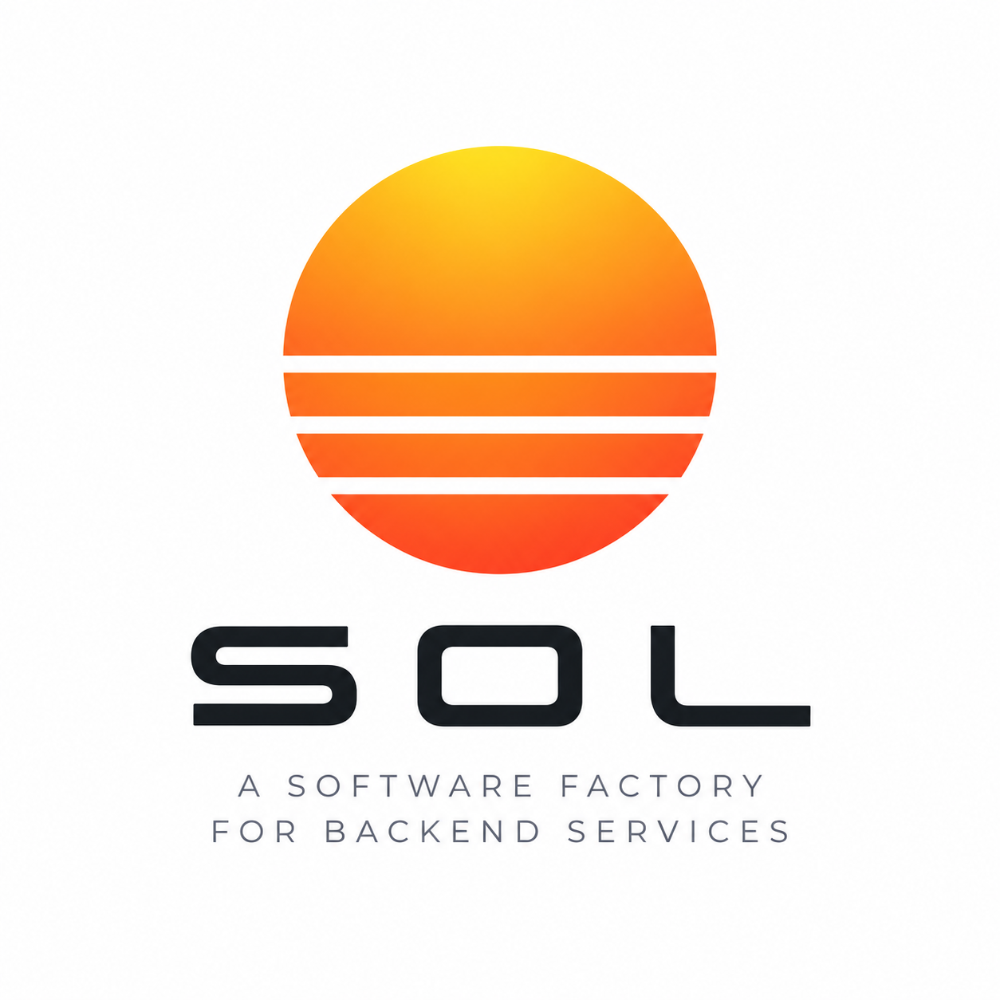

<p align="center">
  
</p>

# Sol

Sol is an open-source OCaml software factory for backend systems. Write direct-style OCaml domain logic; Sol scaffolds, builds, packages, observes, and deploys it — no hand-written Dockerfiles, Kubernetes YAML, CI glue, or infrastructure wiring. Its conventions are regular enough that AI coding agents produce correct output without touching Kubernetes internals, and OCaml's type system (no null, errors as values, exhaustive pattern matching, Eio's structured concurrency) catches entire classes of bugs before they ship.

---

## What it looks like

```ocaml
(* app/payments/charge_svc/lib/handler.ml — routes, trimmed *)
let routes pool = [
  Route.get "/health" ~auth:`Public (fun _req -> Response.ok "ok");
  Route.post "/charges" ~auth:`Public (fun req -> (* validate req.body, then: *)
    match Notification.insert pool ~charge_id ~customer_id ~amount_cents ~currency with
    | Ok ()   -> Response.json ~status:202 (Printf.sprintf {|{"id":"%s","accepted":true}|} charge_id)
    | Error e -> Response.internal_error ("db insert failed: " ^ Pg_error.to_string e));
]
```

```ocaml
(* bin/main.ml — the entrypoint, trimmed: env/observability/db-pool setup omitted *)
let () = Eio_main.run @@ fun env ->
  (* ... build `obs` (observability handle) and `pool` (DB pool) here ... *)
  Service.run (Handler.routes pool) ~env ~ot:obs ()
  |> Result.map_error Service.run_error_to_string
  |> function Ok () -> () | Error e -> failwith e
```

Sol owns the server lifecycle, graceful shutdown, structured logging, metrics, tracing, packaging, and deployment. You write routes, handlers, and domain logic.

---

## Quickstart

**Prerequisites:** k3d, Helm, Docker, kubectl, and `librdkafka-dev`/`libpq-dev`/`libpq5`.

```bash
# Install (Linux x86_64) — replace vX.Y.Z with the latest release:
# https://github.com/loganbnielsen/sol/releases
curl -L https://github.com/loganbnielsen/sol/releases/latest/download/sol-vX.Y.Z-linux-x86_64.tar.gz | tar xz
export PATH="$PWD/sol-vX.Y.Z-linux-x86_64/bin:$PATH"

sol dev up              # local cluster: Redpanda, PostgreSQL, Loki, Prometheus, Grafana
sol new workspace pluto
cd pluto
sol up                  # build + deploy
sol status

curl localhost:8080/health
# ok
```

That's a real HTTP service, backed by a Kafka worker and PostgreSQL, with logs and metrics already flowing. Continue with the **[Tutorial](docs/guides/TUTORIAL.md)** for the full walkthrough — publishing events, database migrations, Grafana dashboards, production deploys, and rollbacks.

---

## What Sol handles

- **Kafka** — topic provisioning, schema registration, Confluent wire format, producer/consumer lifecycle
- **HTTP** — REST routing, middleware, request/response types
- **Storage** — PostgreSQL via caqti, typed table functor, migrations
- **Observability** — structured logs to Loki, metrics to Prometheus, Grafana dashboards, wired automatically
- **Deployment** — Kubernetes manifests, Terraform for cloud infrastructure, Argo CD for GitOps, CI workflow references

You write domain logic. Sol handles the factory work: scaffold, build, package, deploy, observe, inspect, roll back.

---

## Application model

A Sol workspace organizes services by domain team, with typed events as the only contract between them. `sol new workspace` scaffolds an `-svc` and a `-worker`; `sol new fn`/`sol new worker`/`sol new svc` add more as a workspace grows:

```
myapp/
  events/payments/charged.ml     ← event contract, owned by the publishing team
  app/
    payments/charge_svc/         ← REST API service   (-svc)
    comms/notify_worker/         ← Kafka consumer      (-worker)
    billing/invoice_fn/          ← scheduled function  (-fn)
  db/migrations/
  dune-project
```

`-svc` is a REST API service, `-worker` is a Kafka consumer, `-fn` is a scheduled function — the three primitives every domain team builds with. Teams don't share code across domains; they publish and subscribe to typed Kafka events, enforced at the wire level by Sol's schema registry integration.

See [Product Architecture](docs/architecture/PRODUCT_ARCHITECTURE.md) for the full factory model and design principles.

---

## Deployment

Sol targets Kubernetes. Run locally against a k3d cluster with `sol up`, or ship to your own AWS/GCP infrastructure with `sol deploy` (direct or GitOps) — the same application model compiles to Kubernetes manifests and Terraform either way. `sol cloud plan/apply` provisions the underlying cluster, registry, and database in your own cloud account; Sol never owns your infrastructure.

See the [Tutorial](docs/guides/TUTORIAL.md), [Factory Pipeline](docs/architecture/devops-pipeline.md), and [deployment escape hatches](docs/deployment/escape-hatches.md) (per-service `sol.toml` overrides) for details.

---

## Status

Sol is under active development and not yet production-stable. HTTP services, Kafka workers, scheduled functions, PostgreSQL, observability, local development, and Kubernetes deployment are implemented and dogfooded end-to-end. Cloud infrastructure provisioning and the AWS integration layer are further along than most other pieces but still experimental.

See [ROADMAP.md](docs/planning/ROADMAP.md) for the current implementation status, layer by layer, and what's planned next.

---

## Docs

- [Tutorial](docs/guides/TUTORIAL.md) — full walkthrough, start to finish
- [Product Architecture](docs/architecture/PRODUCT_ARCHITECTURE.md) — factory model, design principles, ownership lanes
- [Factory Pipeline](docs/architecture/devops-pipeline.md) — what each `sol` command does
- [Deployment escape hatches](docs/deployment/escape-hatches.md) — `sol.toml` reference
- [Roadmap](docs/planning/ROADMAP.md) — current status and what's next
- [Contributor map](docs/architecture/contributing-map.md) — where to make common changes
- Build-from-source, running tests, and the full repo layout: [`.claude/CLAUDE.md`](.claude/CLAUDE.md)

<!-- SCRATCH-999 e2e proof: harmless, removed with this ticket's cleanup -->
