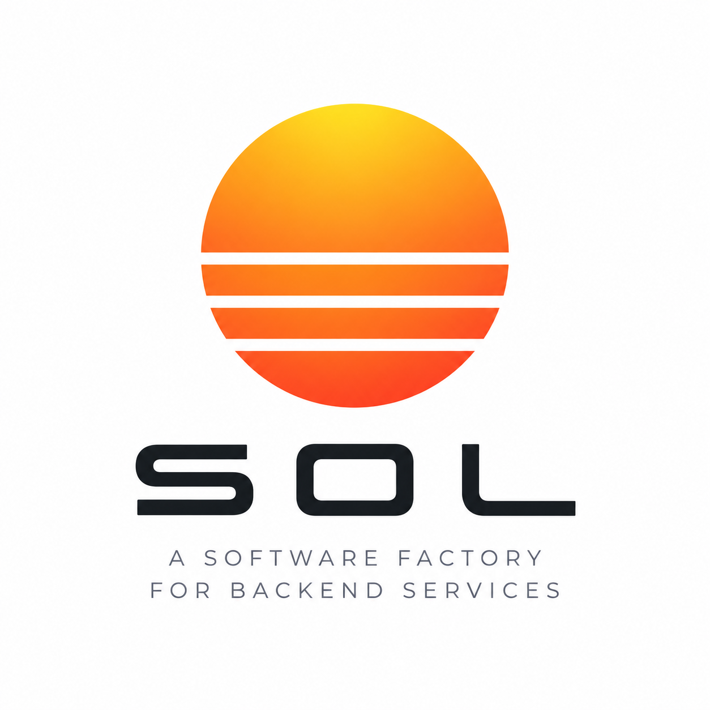

<p align="center">
  
</p>

# Sol

Sol is an open-source software factory for backend systems. Write domain logic in **OCaml or TypeScript** — both are first-class application languages on one language-neutral platform. Sol scaffolds, builds, packages, observes, and deploys either, against a single contract: the same schema-registry conventions, trace propagation, metric vocabulary, retry/DLQ semantics, and deploy lifecycle, in every language. OCaml is the deepest-supported path and where Sol's architecture is proven; TypeScript is the broadest on-ramp for backend developers. (Sol's own CLI and platform are written in OCaml, and are language-neutral in what they do.) Its conventions are regular enough that AI coding agents produce correct output without touching Kubernetes internals, and OCaml's type system (no null, errors as values, exhaustive pattern matching, Eio's structured concurrency) catches entire classes of bugs before they ship.

Sol's promise is a PaaS-simple deployment experience on infrastructure you own.
The factory is Sol's; the cloud account, registry, database and DNS are yours, and
stopping use of Sol does not stop what it deployed. There is no Sol-operated
control plane in the core product: everything on the happy path runs from the Sol
CLI, your own CI, or resources Sol installs into your account. Setup is designed
to happen once per account; after that, deployment is essentially
`sol deploy <target>`. The intended experience — and what is implemented versus
still planned — is in
**[The Sol developer experience](docs/DEVELOPER_EXPERIENCE.md)**.

---

## What it looks like

```ocaml
(* app/payments/charge_svc/lib/handler.ml — routes, trimmed *)
let routes pool = [
  Route.external_ (Route.get "/health" (fun _req -> Response.ok "ok"));
  Route.external_ (Route.post "/charges" (fun req -> (* validate req.body, then: *)
    match Notification.insert pool ~charge_id ~customer_id ~amount_cents ~currency with
    | Ok ()   -> Response.json ~status:202 (Printf.sprintf {|{"id":"%s","accepted":true}|} charge_id)
    | Error e -> Response.internal_error ("db insert failed: " ^ Pg_error.to_string e)));
]
```

```ocaml
(* bin/main.ml — the entrypoint, trimmed: env/observability/db-pool setup omitted *)
let () = Eio_main.run @@ fun env ->
  (* ... build `obs` (observability handle) and `pool` (DB pool) here ... *)
  Service.run (Handler.routes pool) ~env ~ot:obs ()
  |> Result.map_error Service.run_error_to_string
  |> function Ok () -> () | Error e -> failwith e
```

Sol owns the server lifecycle, graceful shutdown, structured logging, metrics, tracing, packaging, and deployment. You write routes, handlers, and domain logic.

---

## Quickstart

**Prerequisites:** k3d, Helm, Docker, kubectl, and `librdkafka-dev`/`libpq-dev`/`libpq5`.

```bash
# Install (Linux x86_64) — replace vX.Y.Z with the latest release:
# https://github.com/sol-fab/sol/releases
curl -L https://github.com/sol-fab/sol/releases/download/vX.Y.Z/sol-vX.Y.Z-linux-x86_64.tar.gz | tar xz
export PATH="$PWD/sol-vX.Y.Z/bin:$PATH"
sol assets                # check the install: where its assets come from, and that each is there

sol local infra up        # local cluster: Redpanda, PostgreSQL, Loki, Prometheus, Grafana
sol new workspace pluto
cd pluto
sol up                  # build + deploy
sol local status

curl localhost:8080/health
# ok
```

That's a real HTTP service, backed by a Kafka worker and PostgreSQL, with logs and metrics already flowing. Continue with the **[Tutorial](docs/guides/TUTORIAL.md)** for the full walkthrough — publishing events, database migrations, Grafana dashboards, production deploys, and rollbacks.

This is the **local** path, and it needs no cloud account. Deploying the same
workspace to your own AWS or GCP runs `sol deploy <env>/<provider>/<region>`: the
first run observes the account's durable installation, sets it up in place if it is
missing, reconciles the environment, establishes its own cluster access as the
target's deploy identity, and continues into the application. The
**[installation and first-deploy guide](docs/guides/installation.md)** is that path
end to end, from an empty account to a live endpoint.
The intended first-run flow, its current status, and what stays your
responsibility are in **[The Sol developer experience](docs/DEVELOPER_EXPERIENCE.md)**.

A release is self-contained: `sol-vX.Y.Z/bin/sol` uses only the assets in
`sol-vX.Y.Z/share/sol/vX.Y.Z/` (Terraform roots, Helm values, dashboards) and the
migration-runner image published with that version, pinned by digest
(see [installation](docs/guides/installation.md)). It needs glibc 2.35 or newer
(Ubuntu 22.04+) and the `libpq5` and `libgmp10` libraries. The install can be
read-only: `sol cloud` runs Terraform in a working directory of its own per target,
under `~/.local/share/sol/terraform/`.

The CLI and its platform assets need no Sol checkout. One thing still does:
generated OCaml workspaces still require source framework packages until
RELEASE-005 publishes them (`bash platform/local/scripts/prepare-framework-deps.sh`
from a checkout).

### Building from source (contributors)

The tarball above is the supported install. Building `sol` from a checkout needs
a little more, and none of it is covered by `dune build` alone:

- **OCaml 5.4.1 or newer.** `dune-project` requires `ocaml >= 5.4.0`. Refresh the
  opam index first (`opam update`) — a stale index does not know about 5.4.1 — then
  `opam switch create 5.4.1` and `opam install dune` (a fresh switch has no dune).
- **System packages:** `librdkafka-dev libpq-dev libpq5 build-essential pkg-config`.
- **Eleven external `*-eio` packages.** `sol.opam` depends on `kafka-eio`,
  `obs-eio`, `obs-loki-eio`, `obs-prometheus-eio`, `obs-tempo-eio`, `pg-eio`,
  `aws-eio`, `s3-eio`, `dynamodb-eio`, `lambda-eio`, and `https-eio`. Several are
  not on opam yet. `support-refs.txt` declares the exact commit of each that this
  revision builds against; pin them all with
  `bash internal/ci/pin-support-packages.sh`, then
  `opam install --deps-only --with-test .`.
- **Build:** `dune build cli/bin/main.exe`; the binary lands at
  `_build/default/cli/bin/main.exe`.

**[`internal/pipeline/dogfood/DOGFOOD.md`](internal/pipeline/dogfood/DOGFOOD.md)** has the full
local-substrate walkthrough, including the exact dependency commands.

---

## What Sol handles

- **Kafka** — topic provisioning, schema registration, Confluent wire format, producer/consumer lifecycle
- **HTTP** — REST routing, middleware, request/response types
- **Storage** — PostgreSQL via caqti, typed table functor, migrations
- **Observability** — structured logs to Loki, metrics to Prometheus, Grafana dashboards, wired automatically
- **Deployment** — Kubernetes manifests, Terraform for cloud infrastructure, Argo CD for GitOps, CI workflow references

You write domain logic. Sol handles the factory work: scaffold, build, package, deploy, observe, inspect, roll back.

---

## Application model

A Sol workspace organizes services by domain team, with typed events as the only contract between them. `sol new workspace` scaffolds an `-svc` and a `-worker`; `sol new fn`/`sol new worker`/`sol new svc` add more as a workspace grows:

```
myapp/
  events/payments/charged.ml     ← event contract, owned by the publishing team
  app/
    payments/charge_svc/         ← REST API service   (-svc)
    comms/notify_worker/         ← Kafka consumer      (-worker)
    billing/invoice_fn/          ← scheduled function  (-fn)
  db/migrations/
  dune-project
```

`-svc` is a REST API service, `-worker` is a Kafka consumer, `-fn` is a scheduled function — the three primitives every domain team builds with. Teams don't share code across domains; they publish and subscribe to typed Kafka events, enforced at the wire level by Sol's schema registry integration.

See [Product Architecture](docs/architecture/PRODUCT_ARCHITECTURE.md) for the full factory model and design principles.

### TypeScript

TypeScript is a first-class application language: the same application model
and operational conventions, implemented idiomatically on the Node ecosystem
(`kafkajs`, `pg`, Fastify, `prom-client`) with Sol supplying only the
semantics and integration glue those libraries do not. Today that layer is four
published npm packages, all Apache-2.0:

- [`@sol-fab/kafka`](https://github.com/loganbnielsen/sol-kafka) — Kafka policy
  layer over `kafkajs`: schema-registry ordering/fatality, explicit topic
  provisioning, the Confluent wire format, decode/retry/crash routing, retry/DLQ
  record conventions, and trace propagation.
- [`@sol-fab/obs`](https://github.com/loganbnielsen/sol-obs) — metric names,
  label vocabularies, Loki push shape, and W3C `traceparent` propagation, so TS
  and OCaml workloads land in the same Grafana panels and Tempo traces.
- [`@sol-fab/svc`](https://github.com/loganbnielsen/sol-typescript) — the service
  lifecycle contract: bounded drain (`drainTimeoutMs`, matching the OCaml
  `sol-svc`'s `drain_timeout_s`) and idempotent `SIGTERM`/`SIGINT` handling.
- [`@sol-fab/worker`](https://github.com/loganbnielsen/sol-typescript) — the
  worker lifecycle contract, for a unit that owns no request boundary. It has no
  `on_ready` equivalent yet (DEC-028), which is one of the triggers that stages
  TypeScript behind the production profile (DEC-026 §2) — see
  [compatibility](docs/deployment/compatibility.md).

Ownership follows the extraction: `@sol-fab/kafka` and `@sol-fab/obs` each live
in their own public repository with their own CI, while `@sol-fab/svc` and
`@sol-fab/worker` share
[`loganbnielsen/sol-typescript`](https://github.com/loganbnielsen/sol-typescript).
All four are published with build provenance, the same extraction pattern used
for the OCaml `*-eio` packages. They are consumed from npm; this repo no longer
carries `packages/`. Releases are tokenless (npm trusted publishing / OIDC).

The runnable showcase is
[`examples/pluto/app/demo_ts`](examples/pluto/app/demo_ts/README.md): a
TypeScript `-svc` and `-worker` deployed by the same Sol CLI and Kubernetes
machinery, exercising a live cross-service, trace-linked Kafka run. It installs
`@sol-fab/*` from npm and is deliberately its own npm project root — it also
serves as the conformance fixture proving a Sol workspace needs no enclosing
JavaScript workspace to consume them (DEC-024). CI deploys it for real
(`golden-path-smoke-ts`, plus the demo's own install/typecheck and Dockerfile
smoke jobs), so the deployed path is exercised, not merely claimed.

`sol new svc` and `sol new worker` support `--language typescript`; OCaml
remains the default. `sol new fn` currently supports OCaml only. See
[application authoring](docs/guides/application-authoring.md) for both languages.

---

## Deployment

Sol targets Kubernetes. Run locally against a k3d cluster with `sol up`, or ship to your own AWS/GCP infrastructure with `sol deploy <env>/<provider>/<region>` (direct or GitOps) — the same application model compiles to Kubernetes manifests and Terraform either way. `sol cloud plan/apply` provisions the underlying cluster, registry, and database in your own cloud account; Sol never owns your infrastructure.

Two things are worth distinguishing, because conflating them is the usual source
of lifecycle confusion:

- **Installation** is the durable, account-level layer — Terraform state and
  locking, the provisioner/deploy/operator identities, and the delegated DNS
  zone. It is designed to be set up once and removed only by an explicit
  `sol uninstall`, never by destroying an environment.
- **An environment** is one disposable target — its network, cluster, database
  and workloads. `sol cloud destroy <target>` removes the environment and is
  designed to leave the installation intact, so redeploying does not redo
  registrar or DNS work.

See [The Sol developer experience](docs/DEVELOPER_EXPERIENCE.md) for the model,
the [Tutorial](docs/guides/TUTORIAL.md), [Factory Pipeline](docs/architecture/devops-pipeline.md), and [deployment escape hatches](docs/deployment/escape-hatches.md) (per-service `sol.toml` overrides) for the details.

---

## Status

Sol is under active development and not yet production-stable. HTTP services, Kafka workers, scheduled functions, PostgreSQL, observability, local development, and Kubernetes deployment are implemented and dogfooded end-to-end. Cloud infrastructure provisioning and the AWS integration layer are further along than most other pieces but still experimental.

Current product behavior and status are described in [The Sol developer experience](docs/DEVELOPER_EXPERIENCE.md); future work is tracked in GitHub Issues.

---

## Repository layout

Sol is a platform, a language-neutral application contract, and first-party
framework implementations of that contract. The first level of the repository
is split by audience: `docs/` for people using Sol, `internal/` for people
building it:

```text
sol/
├── cli/         # the `sol` CLI and the platform implementation it drives
├── framework/   # first-party implementations: OCaml here, TypeScript in sibling repos
├── examples/    # runnable applications that teach the product (start with pluto)
├── docs/        # for people using Sol: guides, reference (the application contract), deployment, architecture
└── internal/    # maintainer machinery: ci, qualification, tooling, fixtures
```

- **Use or manage Sol** → [`cli/`](cli/) and [`docs/reference/`](docs/reference/).
- **Build an application** → [`framework/`](framework/) and [`examples/pluto/`](examples/pluto/).
- **Work on Sol itself** → [contributor guidance](CONTRIBUTING.md) and [`AGENTS.md`](AGENTS.md).

## Docs

- [The Sol developer experience](docs/DEVELOPER_EXPERIENCE.md) — the product promise, the first deploy, and what is built versus planned
- [Documentation map](docs/README.md) — what exists, who each page is for, and the documentation roadmap
- [Tutorial](docs/guides/TUTORIAL.md) — full walkthrough, start to finish
- [Contract](docs/reference/README.md) — the language-neutral application contract
- [TypeScript packages](https://github.com/loganbnielsen/sol-typescript) — the four published `@sol-fab/*` packages ([`kafka`](https://github.com/loganbnielsen/sol-kafka), [`obs`](https://github.com/loganbnielsen/sol-obs), `svc`, `worker`), plus the [`demo_ts`](examples/pluto/app/demo_ts/README.md) showcase
- [Product Architecture](docs/architecture/PRODUCT_ARCHITECTURE.md) — factory model, design principles, ownership lanes
- [Factory Pipeline](docs/architecture/devops-pipeline.md) — what each `sol` command does
- [Deployment escape hatches](docs/deployment/escape-hatches.md) — `sol.toml` reference
- [Developer experience](docs/DEVELOPER_EXPERIENCE.md) — current product behavior, ownership, and lifecycle
- Build-from-source, running tests, and the full repo layout: [`AGENTS.md`](AGENTS.md)

## License

Apache-2.0 — see [LICENSE](LICENSE). The "Sol" name and logo are covered by
[TRADEMARK.md](TRADEMARK.md), not by that licence. Outside contributions are not
being accepted yet — see [CONTRIBUTING.md](CONTRIBUTING.md).
